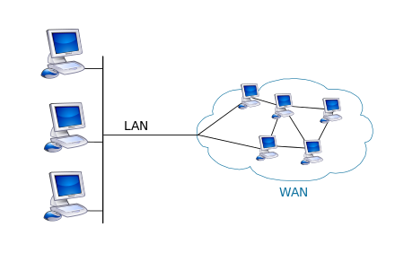
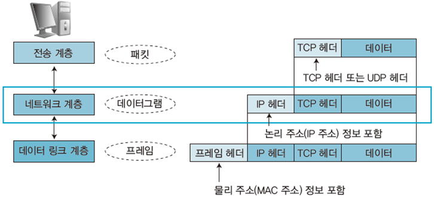

  <h1>Network</h1>

**Contents**
- [Network](#network)
- [Packet](#packet)
- [LAN/WAN](#lanwan)
- [Protocol](#protocol)
- [Physical Layer](#physical-layer)
- [Cable](#cable)
- [Ethernet](#ethernet)
- [MAC Address](#mac-address)
- [Switch](#switch)
- [Duplex](#duplex)
- [Router](#router)
- [Internet Protocol](#internet-protocol)
- [IP Address](#ip-address)
- [Network/Broadcast Address](#networkbroadcast-address)
- [Subnet](#subnet)
---
## Network

 

    

 

- 컴퓨터 네트워크는 노드들이 자원을 공유할 수 있게 하는 디지털 전기 통신망이다.
- 분산되어 있는 컴퓨터를 통신망으로 연결한 것으로 서로 데이터를 교환한다.

## Packet

 

    

 

- 네트워크를 통해 전송되는 데이터의 작은 조각이다.
- 데이터가 클 경우 네트워크 대역폭을 많이 차지하기 때문에 다른 패킷의 흐름을 막을 수 있어 패킷으로 분할한다.

## LAN/WAN

 

    

 

- LAN(Local Area Network)은 근거리 통신망이다.
- LAN은 건물 안이나 특정 지역을 범위로 하는 네트워크로, 사무실 등 지리적으로 제한된 곳에서 연결할 수 있는 네트워크이다.
- LAN은 WAN 보다 범위가 좁기 때문에 비교적 속도가 빠르며, 오류가 적다.

 

    

 

- 회사에서는 영역별로 스위치, 라우터 등으로 구분하여 랜을 구성한다.
- DMZ는 서버를 외부에 공개하기 위한 네트워크 영역으로, 보통 웹 서버, 메일 서버, DNS 서버를 공개한다.
- 사내 또는 데이터 센터에 서버를 두고 운용하는 것을 온프레미스(on-premise)라고 한다. 이는 클라우드와 대비된다.

 

    

 

- WAN(Wide Area Network)는 광대역 통신망이다.
- WAN은 지리적으로 넓은 범위에 구축된 네트워크로, ISP(Internet Service Provider)가 제공하는 서비스에 의해 구축된다.
- ISP는 인터넷 서비스 제공자가 제공하는 서비스로 KT, U+, SK브로드밴드 등이 있다.
- WAN은 LAN보다 범위가 넓기 때문에 비교적 속도가 느리며, 오류가 많다.

## Protocol

 

    

 

- 프로토콜은 통신을 위한 규칙이다.
- 이를 위해 OSI 모델, TCP/IP 모델 등 네트워크 객체들간의 규격, 순서들을 정의한다.

 

    

 

 

    

 

- OSI 모델은 국제표준화기구 ISO에서 제정한 표준 규격이다.
- 이를 통해 데이터 송수신이 이루어지고, 이는 7계층으로 나눠서 진행된다.
- 송신은 상위 계층에서 하위 계층으로 데이터를 전달한다.
- 수신은 하위 계층에서 상위 계층으로 전달된 데이터를 받게 된다.

 

    

 

- TCP/IP 모델은 4계층으로 구성된다.
- OSI 모델과 구성은 비슷하나 응용 계층, 전송 계층, 인터넷 계층, 네트워크 접속 계층으로 구성된다.

 

    

 

- 데이터 송신시 캡슐화가, 수신시 역캡슐화가 이루어진다.
- 데이터 전달 시 필요한 정보를 추가하는데 이를 헤더라고 한다.
- 캡슐화란, 데이터 전송시 헤더를 붙여나가는 것을 의미한다.
- 역캡슐화란, 데이터 수신시 붙여진 헤더를 제거하는 것을 의미한다. 

 

    

 

- 전송 계층에서는 신뢰할 수 있는 통신을 구현하기 위한 헤더를 붙인다.
- 네트워크 계층에서는 다른 네트워크와 통신하기 위한 헤더를 붙인다.
- 데이터 링크 계층에서는 물리적 통신 채널을 연결하기 위한 헤더와 트레일러를 붙인다.
- 여기서 트레일러는 데이터를 전달할 때 데이터의 마지막에 추가하는 정보를 의미한다.
- 마지막 물리 계층에서는 데이터 링크 계층에서 구성된 데이터를 전기 신호로 변환해서 수신측에 전달한다.

## Physical Layer
 

    

 

<!-- https://ryufree.tistory.com/25 -->

- 0과 1만으로 이루어진 비트열을 전기 신호로 변환하려면 물리 계층의 기술이 필요하다.
- 물결 모양의 신호를 아날로그 신호라고 한다. 이는 전화 회선이나 라디오 방송에 사용된다.
- 막대 모양의 신호를 디지털 신호라고 한다.
- 아날로그와 디지털 신호는 랜 카드를 통해 변환되어 통신이 이루어진다.

## Cable

 

    

 

<!-- https://linkhub.tistory.com/85 -->

- 전송 매체는 데이터가 흐르는 물리적인 선로를 의미한다. 이는 유선과 무선으로 구분된다.
- 유선에는 트위스트 페어 케이블과 광케이블 등이 있고, 무선에는 라디오파, 마이크로파, 적외선 등이 있다.
- 트위스트 페어 케이블의 종류에는 UTP, STP 케이블로 구성된다.
- UTP 케이블은 실드로 보호되어 있지 않아 노이즈의 영향을 받기 쉽지만 저렴하다.
- STP 케이블은 실드로 보호되어 있어 노이즈의 영향을 적게 받지만 비싸기 때문에 보편적으로 사용하지 않는다.

 

    

 

<!-- https://thankee.tistory.com/7 -->

- 랜 케이블에는 다이렉트와 크로스 케이블로 나뉜다.
- 다이렉트 케이블은 구리 선 여덟 개를 같은 순서로 커넥터에 연결한 케이블이다. 이는 컴퓨터와 스위치를 연결할 때 사용한다.
- 크로스 케이블은 구리선 여덟 개 중 한쪽 커넥터의 1, 2번에 연결되는 구리 선을 다른 쪽 커넥터의 3, 6번과 연결한 케이블이다. 컴퓨터 간에 직접 랜 케이블로 연결할 때 사용한다.
- 두가지 모두 1, 2, 3, 6번 구리선만 사용한다. 

## Repeater/Hub

 

    

 

<!-- http://itnovice1.blogspot.com/2019/08/osi-7.html -->

- 리피터는 전기신호를 복원하고 증폭하는 기능을 가지는 네트워크 중계 장비로, 통신하는 상대방이 멀리 있을 때 사용한다.
- 허브는 포트를 여러개로 구성되어 여러 대와 통신이 가능하다. 허브 또한 리피터의 기능을 갖고 있다.
- 허브 내에서 데이터가 전송될 경우 전송한 포트를 제외한 모든 포트에서 데이터가 전송된다. 이로인해 더미 허브라고 불린다.

## Ethernet
- 랜에서 데이터를 주고받기위해 데이터 링크 계층의 기술이 필요하다.
- 데이터 링크 계층은 네트워크 장비 간 신호를 주고받는 규칙을 정하는 계층이다.
- 이더넷은 그 규칙들 중 가장 많이 사용되는 규칙이다.
- CSMA/CD는 데이터 충돌을 막기 위한 이더넷 방법으로 데이터의 시점을 조절하여 여러 컴퓨터가 동시에 데이터를 전송해도 충돌이 이루어지지 않게 한다.

 

    

 

<!-- https://velog.io/@aksmf1442/%EB%AA%A8%EB%91%90%EC%9D%98-%EB%84%A4%ED%8A%B8%EC%9B%8C%ED%81%AC-%EC%A0%95%EB%A6%AC-4%EC%9E%A5%EB%8D%B0%EC%9D%B4%ED%84%B0-%EB%A7%81%ED%81%AC-%EA%B3%84%EC%B8%B5-%EB%9E%9C%EC%97%90%EC%84%9C-%EB%8D%B0%EC%9D%B4%ED%84%B0-%EC%A0%84%EC%86%A1%ED%95%98%EA%B8%B0 -->

- 이더넷은 케이블의 종류나 통신 속도에 따라 다양한 규격으로 분류된다.
- 규격에서 10은 통신속도(Mbps), BASE는 전송 방식, T는 케이블 종류를 나타낸다.

## MAC Address
- 랜 카드에는 MAC 주소가 있다. 제조할 때 새겨지는 물리 주소로 전 세계 유일 번호로 할당된다.
- MAC 주소는 48비트 숫자로 구성되고 제조사 번호 및 일련번호로 정해진다.
- 이더넷 헤더에서 MAC 주소가 붙어 통신이 이루어진다.

## Switch
- 스위치는 데이터 링크 계층에서 동작한다.
- 스위치 내부에는 MAC 주소 테이블이 있고, 테이블에는 데이터 베이스로, 스위치 포트 번호와 해당 포트에 연결되어 있는 MAC 주소가 등록된다.

## Duplex

 

    

 

- 전이중 통신 방식은 동시에 데이터 송수신을 하는 방식이고, 반이중 통신 방식은 회선 하나로 송신과 수신을 번갈아하는 방식이다.
- 허브는 회선 하나로 충돌하지만, 스위치는 회선이 두개로 구성되어 충돌이 발생하지 않아 전이중 통신 방식으로 데이터를 주고받는다.
- 허브에서 충돌이 발생하게 영향이 미치는 범위를 충돌 도메인이라고 한다.

## Router
- Router는 네트워크 계층에서 네트워크 간의 통신을 가능하게 하는 네트워크 장비다.
- 이를 통해 인터넷 환경에서 IP 주소로 데이터를 보낼 수 있게 된다.
- 데이터를 보내는 과정에서 어떤 경로로 데이터를 보낼지 결정하는 것을 라우팅이라 하고, 라우팅 테이블을 통해 경로 정보를 등록 및 관리한다.

## Internet Protocol

 

    

 

- 네트워크 계층에서는 캡슐화할 때 IP 헤더를 붙인다.
- 이렇게 만들어진 것을 IP 패킷이라 한다.

## IP Address
- IP 주소는 인터넷 서비스 제공자(ISP)에게 받고, 버전은 IPv4, IPv6으로 구성된다.
- 또한, 공인과 사설 IP 주소로 구분되는데 공인 IP 주소는 ISP가 제공하고, 사설 IP 주소는 LAN 내에서 할당 시킨다.
- IP 주소는 네트워크의 규모에 따라 A ~ E 클래스로 나누어져 있으며 일반적으로 A ~ C클래스를 사용한다.
- 네트워크 크기에 따라 32비트의 IP 주소를 네트워크 ID와 호스트 ID로 bit를 조정하여 IP 주소를 A ~ E클래스로 구분할 수 있다.

 

    

 

- A 클래스는 8비트의 네트워크 ID와 24비트의 호스트 ID로 구성된다.
- A 클래스의 1옥텟(8비트)의 범위는 2진수로 00000001 ~ 01111111이며 10진수로 변환하면 1 ~ 127이다. 2~4 옥텟의 범위는 0 ~ 255의 범위를 가지고 전체 범위는 1.0.0.0 ~ 127.255.255.255 이다. 

- B 클래스의 1 옥텟의 범위는 2진수로 10000000 ~ 10111111이고, 10진수로 변환하면 128 ~ 191이 된다. 전체 범위는 128.0.0.0 ~ 191.255.255.255가 된다.

- C 클래스의 1옥텟의 범위는 2진수로 11000000 ~ 11011111이며, 10진수로 변환하면 192~223이다. 192.0.0.0 ~ 223.255.255.255의 범위를 가진다.

 

    

 

- 사설 IP 주소는 공인 IP주소로 사용할 수 없다.
- cmd에서 `ipconfig` 명령어를 실행해서 IP 주소를 확인할 수 있다.

---
## Network/Broadcast Address

- 네트워크와 브로드캐스트 주소로 컴퓨터나 라우터가 자신의 IP로 사용하면 안된다.
 

    

 

- 네트워크 주소는 호스트 ID가 10진수로 0, 2진수 00000000인 주소이다. 

- 네트워크 주소는 전체 네트워크에서 작은 네트워크를 식별하는데 사용되고 호스트 ID가 10진수로 0이면 그 네트워크 전체를 대표하는 주소가 된다. 

- 예를들어 192.168.1.0은 네트워크 192.168.1.1 ~ 6의 IP 주소를 대표하는 네트워크 주소이다. 
 

    

 

- 브로드캐스트 주소는 호스트 ID가 10진수로 255고 2진수로 11111111인 주소이다.

- 브로드캐스트 주소는 네트워크에 있는 컴퓨터나 장비 모두에게 한 번에 데이터를 전송하는데 사용되는 전용 IP 주소이다.
- 전체 네트워크에 데이터를 전송하려면 호스트 ID에 255를 설정하면 된다.
- 192.168.1.255의 브로드 캐스트로 데이터를 전송하면 네트워크 안에 있는 모든 컴퓨터가 데이터를 전달 받게 된다.
- 네트워크 주소와 브로드캐스트 주소는 컴퓨터에 설정할 수 없다.

---

## Subnet

- 브로드캐스트로 데이터를 전송하면 수 많은 컴퓨터로 브로드캐스트 패킷이 전송되어 네트워크가 혼잡해질 수 있는데 대규모의 네트워크를 작은 네트워크로 분할하여 브로드캐스트로 전송되는 패킷의 범위를 좁힐 수 있어 IP 주소를 더 효과적으로 활용할 수 있다.

- 네트워크를 분할하는 것을 서브넷팅이라 하고, 분할된 네트워크를 서브넷이라고 한다.

 

    

 

- A 클래스의 경우 네트워크 ID가 8비트 호스트 ID가 24비트로 구성되고 서브넷팅할 경우 네트워크 ID, 서브넷ID, 호스트ID로 나눠진다. 서브넷 ID는 호스트 ID에서 비트를 빌려 생성된다.

 

*서브넷마스크란?*

- IP 주소를 서브넷팅하면 네트워크 ID와 호스트 ID를 구분하기 어려운데 이때 서브넷마스크를 사용할 수 있다.
- 서브넷 마스크는 네트워크 ID와 호스트 ID를 식별하기 위한 값이다. 
- 
